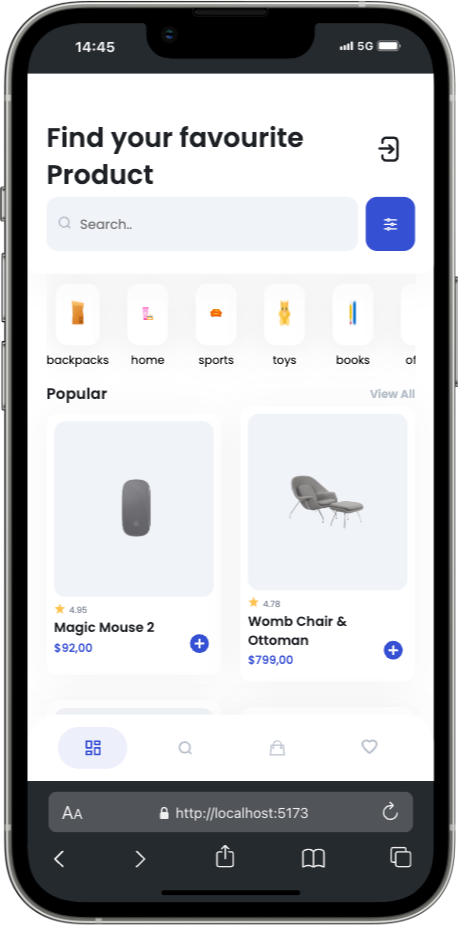

# Project Frontend E-Shop 🛒

<div style="display: flex; justify-content: center;">
  
</div>
<br/>

<p></p>

## Table of Contents 📑

- [About](#about)
- [Tech Stack](#tech-stack)
- [Getting Started](#getting-started)
  - [Prequisites](#prequisites)
  - [Installation](#installation)
  <!-- - [Usage](#usage) -->
- [Design](#design)
- [Deployment](#deployment)
- [Contributors](#contributors)

## About

This project is the frontend portion of an e-shop application, built as part of a Fullstack Web Dev Bootcamp.

**The goals for this project were:**

- To gain experience building a user interface with React.
- To implement essential e-commerce functionalities like product display, search and filter for products, shopping cart, etc.
- To learn best practices for structuring and styling a React application.

<div style="display: flex; justify-content: space-between; align-items: flex-end; width: 100%">
    
    
</div>

## Tech Stack

<!-- hier eine Website mit Badges, die du verwenden koenntest: ⬇️ -->
<!-- https://github.com/alexandresanlim/Badges4-README.md-Profile -->

**Markup:**  
  
**Styling:**  
  
**Library**  
  
**IDE:**  
  
**Version Control:**  
  
**Project Management:**  
  
**Design:**  
  
**Communication**  


## Getting Startet

Follow these simple steps to set up and run the "Frontend E-Shop" project on your local machine.

### Prerequisites

Before you begin, ensure you have the following installed:

- Git ([Git download](https://git-scm.com/))
- Node.js and npm (download from [Node.js official site](https://nodejs.org/))
- A code editor (Visual Studio Code is recommended)

### Installation

1. **Clone the repository:**

   ```bash
   git clone https://your-github-username/frontend-e-shop.git
   ```

2. **Install dependencies:**
   ```bash
   cd frontend-e-shop
   npm install
   ```

### Running the Project

3. **Start the development server:**

   ```bash
     npm run dev
   ```

**This will start a local server and open the application in your default web browser. You're all set! Explore the "Frontend E-Shop" project and enjoy the journey.**

## Design

The design for "Frontend E-Shop" was provided as part of the Bootcamp and created using Figma. This design served as a blueprint to guide the development of the project, ensuring a cohesive and visually appealing user experience.

## Deployment

The "Frontend E-Shop" project is deployed using Netlify, making it easily accessible to everyone
The deployed version of this Project is available at:

https://e-shop-frontend.netlify.app/

## Contributors


**GitHub Profiles:**

- [Elisaatnam](https://github.com/Elisaatnam)
- [CreateYourReality](https://github.com/CreateYourReality)
- [Quaselz](https://github.com/Quaselz)
- [Alpy81](https://github.com/Alpy81)
